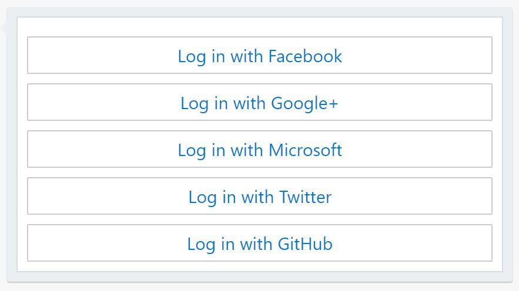
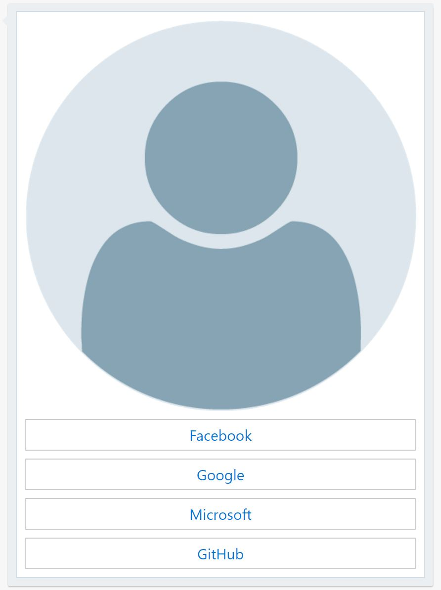
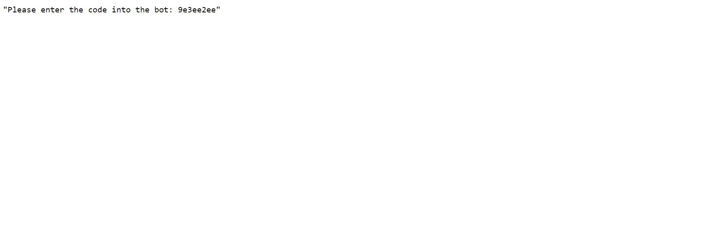
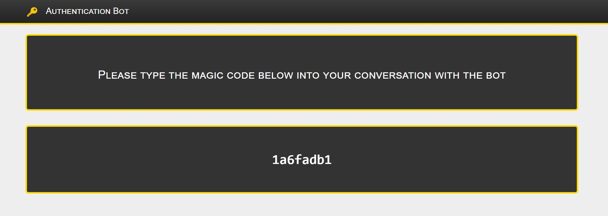

# botbuilder-simple-authentication

#### Table of Contents
1. [Basic Usage](#basic)
1. [Samples](#samples)
1. [Configuration Properties](#properties)
1. [Using Environment Variables](#env)
1. [Custom Scopes](#scopes)
1. [Custom Button Text](#text)
1. [Custom Authentication Card](#card)
1. [Custom Magic Code HTML](#code)
1. [Custom Azure AD Tenants and Resources](#customazure)

<div id='basic'></div>

## Basic Usage

```BotAuthenticationMiddleware``` assumes control of the conversation flow when a user is not authenticated and provides the user's access token after successful login. 

The middleware minimally requires 3 configuration properties:
1. A method that returns whether the user is authenticated or not.
1. A method that is triggered after the user has logged in successfully that receives the user's access token.
1. At least one clientId/clientSecret for an application created with a supported provider.

#### Installation

```
npm install botbuilder-simple-authentication
```

#### Import the botbuilder-simple-authentication module

```javascript
let simpleAuth = require('botbuilder-simple-authentication');
```

#### Create a BotAuthenticationConfiguration

```javascript
let storage = new builder.MemoryStorage();
const conversationState = new builder.ConversationState(storage);
adapter.use(conversationState);

const authenticationConfig = {
	isUserAuthenticated: (context) => {
		//if this method returns false, the middleware will take over
		const state = conversationState.get(context);
		return state.authData;
	},
	onLoginSuccess: async (context, accessToken, provider) => {
		//the middleware passes over the access token retrieved for the user
		const state = conversationState.get(context);
		state.authData = { accessToken, provider };
		await context.sendActivity(`You're logged in!`);
	},
	facebook: {
		clientId: 'FACEBOOK_CLIENT_ID',
		clientSecret: 'FACEBOOK_CLIENT_SECRET'
	}
};
```

#### Implement the BotAuthenticationMiddleware

```javascript
adapter.use(new simpleAuth.BotAuthenticationMiddleware(server, adapter, authenticationConfig));
```

#### Create an Application with a Supported Provider

Navigate to a supported provider's developer site and create a new application. Add the appropriate endpoints to your app's approved redirect urls, then copy the clientId and clientSecret that will be used to create the BotAuthenticationConfiguration.

| Supported Providers | Redirect URL                             | Developer Site                         |
| ------------------- | ---------------------------------------- | -------------------------------------- |
| Facebook            | {BASE_URL}/auth/facebook/callback        | https://developers.facebook.com/apps   |
| AzureADv2           | {BASE_URL}/auth/azureADv2/callback       | https://apps.dev.microsoft.com         |
| Google              | {BASE_URL}/auth/google/callback          | https://console.cloud.google.com/home  |
| GitHub              | {BASE_URL}/auth/github/callback          | https://github.com/settings/developers |

<div id='samples'></div>

## Samples

**/src/samples** contains basic examples with minimal configuration and advanced examples that implement each of the optional configuration properties, for both JavaScript and TypeScript.

<div id='properties'></div>

## Configuration Properties

#### BotAuthenticationConfiguration

| Property                           | Constraint    | Type                                                                  | Description                  |
| ---------------------------------- | ------------- | --------------------------------------------------------------------- | -----------------------------|
| isUserAuthenticated                | Required      | (context: TurnContext) => boolean                                     | Runs each converation turn. The middleware will prevent the bot logic from running when it returns false. | 
| onLoginSuccess                     | Required      | (context: TurnContext, accessToken: string, provider: string) => void | Runs when the user inputs the correct magic code. The middleware passes the user's access token.  |
| onLoginFailure                     | Optional      | (context: TurnContext, provider: string) => void                      | Runs when the user inputs an incorrect magic code. The middleware will force another login attempt by default. |
| customAuthenticationCardGenerator  | Optional      | (context: TurnContext, authorizationUris: {}[]) => Partial< Activity >| Overrides the default Authentication Card. The middleware supplies the authorization uris necessary to build the card. |
| customMagicCodeRedirectEndpoint    | Optional      | string                                                                | Overrides the default magic code display page. The server endpoint provided will receive a redirect with the magic code in the query string. |
| noUserFoundMessage                 | Optional      | string                                                                | Message sent on first conversation turn where the user is not authenticated, immediately prior to the Authentication Card. |
| facebook                           | Optional      | ProviderConfiguration                                                 | Configuration object that enabes Facebook authentication. |
| azureADv2                          | Optional      | ProviderConfiguration                                                 | Configuration object that enables AzureADv2 authentication. |
| google                             | Optional      | ProviderConfiguration                                                 | Configuration object that enables Google authentication. |
| github                             | Optional      | ProviderConfiguration                                                 | Configuration object that enables GitHub authentication. |

#### ProviderConfiguration

| Property                        | Constraint    | Type                  | Providers                      | Description                                                                          |
| ------------------------------- | ------------- | --------------------- | ------------------------------ | ------------------------------------------------------------------------------------ |
| clientId                        | Required      | string                | All                            | ClientId taken from the provider's authentication application.                       |
| clientSecret                    | Required      | string                | All                            | ClientSecret taken from the provider's authentication application.                   |
| scopes                          | Optional      | string[]              | All                            | Scopes that the user will be asked to consent to as part of the authentication flow. |
| buttonText                      | Optional      | string                | All                            | Text displayed inside the button that triggers the provider's authentication flow.   |
| tenant                          | Optional      | string                | AzureADv2                      | Organizational tenant domain.                                                        |
| resource                        | Optional      | string                | AzureADv2                      | identifier of the WebAPI that your client wants to access on behalf of the user.     |

<div id='env'></div>

## Using Environment Variables

Provider clientIds and clientSecrets can be set via environment variables and do not have to be set in ProviderConfiguration objects.

| BotAuthenticationConfiguration Property  | Environment Variable                       |
| ---------------------------------------- | ------------------------------------------ |
| facebook.clientId                        | FACEBOOK_CLIENT_ID                         |
| facebook.clientSecret                    | FACEBOOK_CLIENT_SECRET                     |
| azureADv2.clientId                       | AZURE_AD_V2_CLIENT_ID                      |
| azureADv2.clientSecret                   | AZURE_AD_V2_CLIENT_SECRET                  |
| google.clientId                          | GOOGLE_CLIENT_ID                           |
| google.clientSecret                      | GOOGLE_CLIENT_SECRET                       |
| github.clientId                          | GITHUB_CLIENT_ID                           |
| github.clientSecret                      | GITHUB_CLIENT_SECRET                       |

#### Example .env

```
FACEBOOK_CLIENT_ID = {VALUE}
FACEBOOK_CLIENT_SECRET =  {VALUE}
AZURE_AD_V2_CLIENT_ID =  {VALUE}
AZURE_AD_V2_CLIENT_SECRET = {VALUE}
```

#### Example BotAuthenticationConfiguration

```javascript
let storage = new builder.MemoryStorage();
const conversationState = new builder.ConversationState(storage);
adapter.use(conversationState);

const authenticationConfig = {
	isUserAuthenticated: (context) => {
		//if this method returns false, the middleware will take over
		const state = conversationState.get(context);
		return state.authData;
	},
	onLoginSuccess: async (context, accessToken, provider) => {
		//the middleware passes over the access token retrieved for the user
		const state = conversationState.get(context);
		state.authData = { accessToken, provider };
		await context.sendActivity(`You're logged in!`);
	}
};
```

<div id='scopes'></div>

## Custom Scopes

Each provider declared in the ```BotAuthenticationConfiguration``` object has an optional `scope` property that accepts an array of strings. If custom scopes aren't provided, the following scopes are used by default:


| Provider                 | Scopes                                     |
| ------------------------ | ------------------------------------------ |
| AzureADv2              | User.Read                                  |
| Facebook                 | public_profile                             |
| Google                   | https://www.googleapis.com/auth/plus.login |
| GitHub                   | user                                       |

#### Default Scopes

```javascript
facebook: {
	clientId: 'FACEBOOK_CLIENT_ID',
	clientSecret: 'FACEBOOK_CLIENT_SECRET'
}
```

#### Example Custom Scopes

```javascript
facebook: {
	clientId: 'FACEBOOK_CLIENT_ID',
	clientSecret: 'FACEBOOK_CLIENT_SECRET'
	scopes: ['public_profile', 'email', 'user_likes']
}
```

<div id='text'></div>

## Custom Button Text

Each provider declared in the ```BotAuthenticationConfiguration``` object has an optional `buttonText` property that accepts a string. If custom button text isn't provided, the following strings are used by default:

| Provider                 | Button Text                                |
| ------------------------ | ------------------------------------------ |
| AzureADv2              | Log in with Microsoft                      |
| Facebook                 | Log in with Facebook                       |
| Google                   | Log in with Google+                        |
| GitHub                   | Log in with GitHub                         |

#### Default Button Text

```javascript
facebook: {
	clientId: 'FACEBOOK_CLIENT_ID',
	clientSecret: 'FACEBOOK_CLIENT_SECRET'
}
```

#### Example Custom Button Text

```javascript
facebook: {
	clientId: 'FACEBOOK_CLIENT_ID',
	clientSecret: 'FACEBOOK_CLIENT_SECRET'
	buttonText: 'Facebook'
}
```

<div id='card'></div>

## Custom Authentication Card

The ```customAuthenticationCardGenerator``` property is used to override the default card. The method receives the authorization uris for each provider set in the ```BotAuthenticationConfiguration``` and is responsible for navigating the user to one of them. 

#### Default Authentication Card

<kbd></kbd>

#### Example Custom Authentication Card

<kbd></kbd>

```javascript
customAuthenticationCardGenerator: async (context, authorizationUris) => {
	let cardActions = [];
	let buttonTitle;
	authorizationUris.map((auth) => {
		if (auth.provider === 'azureADv2') {
			buttonTitle = 'Microsoft';
		} else if (auth.provider === 'facebook') {
			buttonTitle = 'Facebook';
		} else if (auth.provider === 'google') {
			buttonTitle = 'Google';
		} else if (auth.provider === 'github') {
			buttonTitle = 'GitHub';
		}
		cardActions.push({ type: 'openUrl', value: auth.authorizationUri, title: buttonTitle });
	});
	let card = builder.CardFactory.heroCard('', ['https://qualiscare.com/wp-content/uploads/2017/08/default-user.png'], cardActions);
	let authMessage = builder.MessageFactory.attachment(card);
	return authMessage;
}
```

<div id='code'></div>

## Custom Magic Code HTML

The ```BotAuthenticationConfiguration``` object has an optional ```customMagicCodeRedirectEndpoint``` property used to override the default magic code HTML display and create a custom page.

In order to fully implement a custom page, the server passed to the middleware will need to expose an endpoint that is referenced by the ```customMagicCodeRedirectEndpoint``` property. ```BotAuthenticationMiddleware``` adds the ```queryParser``` middleware to the restify server and redirects to this endpoint with the magic code in the query string, so the code is accessible via ```req.query.magicCode```. The server is responsible for serving an HTML page capable of displaying the magic code.

#### Default Magic Code HTML

<kbd></kbd>

#### Example Custom Magic Code HTML

<kbd></kbd>

In the example below, restify exposes an endpoint that serves up an html file expecting a magic code in the URL's hash. The ```customMagicCodeRedirectEndpoint``` property is set to another endpoint that parses the magic code and sends it in the hash to the html file.

#### /app.js

```javascript
let storage = new builder.MemoryStorage();
const conversationState = new builder.ConversationState(storage);
adapter.use(conversationState);

const authenticationConfig = {
	isUserAuthenticated: (context) => {
		//if this method returns false, the middleware will take over
		const state = conversationState.get(context);
		return state.authData;
	},
	onLoginSuccess: async (context, accessToken, provider) => {
		//the middleware passes over the access token retrieved for the user
		const state = conversationState.get(context);
		state.authData = { accessToken, provider };
		await context.sendActivity(`You're logged in!`);
	},
	facebook: {
		clientId: 'FACEBOOK_CLIENT_ID',
		clientSecret: 'FACEBOOK_CLIENT_SECRET'
	},
	customMagicCodeRedirectEndpoint: '/customCode'
};

server.get('/customCode', (req, res, next) => {
	//simple redirect where we set the code in the hash and pull it down on the webpage that restify will serve at this endpoint
	let magicCode = req.query.magicCode;
	let hashedUrl = `/renderCustomCode#${magicCode}`;
	res.redirect(302, hashedUrl, next);
});

server.get('/renderCustomCode', restify.plugins.serveStatic({
	//need a public folder in the same directory as this file that contains an index.html page expecting a hash
	'directory': path.join(__dirname, 'public'),
	'file': 'index.html'
}));
```
#### /public/index.html

```html
<!DOCTYPE html>
<html>
<head>
    <meta charset="utf-8">
    <meta http-equiv="X-UA-Compatible" content="IE=edge">
    <meta name="viewport" content="width=device-width, initial-scale=1">
    <title>Authentication Bot - Login Success</title>
    <link rel="stylesheet" href="https://maxcdn.bootstrapcdn.com/bootstrap/3.3.7/css/bootstrap.min.css" integrity="sha384-BVYiiSIFeK1dGmJRAkycuHAHRg32OmUcww7on3RYdg4Va+PmSTsz/K68vbdEjh4u"
        crossorigin="anonymous">
    <link rel="stylesheet" href="https://maxcdn.bootstrapcdn.com/bootstrap/3.3.7/css/bootstrap-theme.min.css" integrity="sha384-rHyoN1iRsVXV4nD0JutlnGaslCJuC7uwjduW9SVrLvRYooPp2bWYgmgJQIXwl/Sp"
        crossorigin="anonymous">
    <style>
        body {
            -moz-user-select: none;
            -webkit-user-select: none;
            -ms-user-select: none;
            user-select: none;
        }
        .navbar {
            border-bottom: 3px solid #FFDB00;
            font-variant: small-caps
        }
        body {
            background-color: #EEEEEE;
        }
        .jumbotron {
            border: 3px solid #FFDB00;
            background-color: #333333;
            color: white;
        }
        h3 {
            font-variant: small-caps;
        }
        logo {
            margin-bottom: 1em;
        }
        #magic_code {
            font-size: 2em;
            font-family: monospace;
            font-weight: bold;
            -moz-user-select: all;
            -webkit-user-select: text;
            -ms-user-select: text;
            user-select: all;
        }
        .jumbotron {
            text-align: center;
        }
        .title {
            color: white !important;
        }
    </style>
</head>
<body>
    <nav class="navbar navbar-inverse navbar-static-top">
        <div class="container">
            <div class="navbar-header">
                <a class="navbar-brand logo">
                    <kbd>
                </a>
                <a class="navbar-brand title">Authentication Bot</a>
            </div>
        </div>
    </nav>
    <div class="container">
        <div class="jumbotron">
            <h3>Please type the magic code below into your conversation with the bot</h3>
        </div>
        <div class="jumbotron">
            <div id="magic_code"></div>
        </div>
    </div>
    <script type="text/javascript">
        document.getElementById("magic_code").innerText = (window.location.hash || '').replace('#', '');
    </script>
</body>
</html>
```

<div id='customazure'></div>

## Custom Azure AD Tenants and Resources

The AzureADv2 provider declared in the ```BotAuthenticationConfiguration``` object has optional `tenant` and `resource` properties that accepts strings. If custom tenant and resource aren't provided, the following values are used by default:

| Property                 | Default Value                              |
| ------------------------ | ------------------------------------------ |
| tenant                   | common                                     |
| resource                 | https://graph.windows.net                  |


#### Default Tenant and Resource

```javascript
azureADv2: {
	clientId: 'AZURE_AD_V2_CLIENT_ID',
	clientSecret: 'AZURE_AD_V2_CLIENT_SECRET'
}
```

#### Example Custom Tenant and Resource

```javascript
azureADv2: {
	clientId: 'AZURE_AD_V2_CLIENT_ID',
	clientSecret: 'AZURE_AD_V2_CLIENT_SECRET',
	tenant: 'microsoft.onmicrosoft.com',
	//VSTS API resource
	resource: '499b84ac-1321-427f-aa17-267ca6975798'
}
```